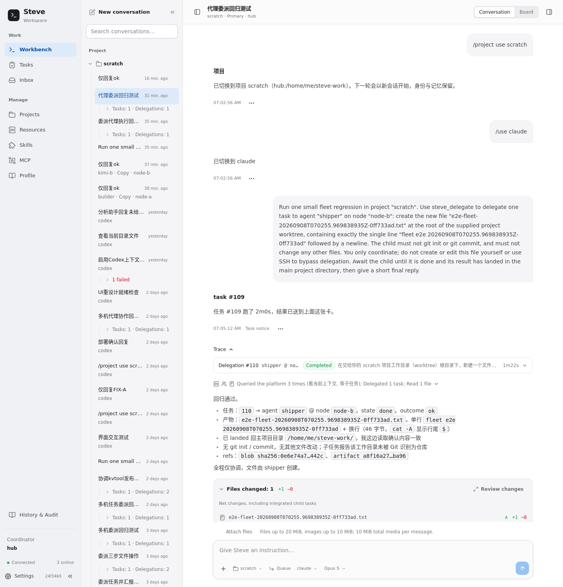
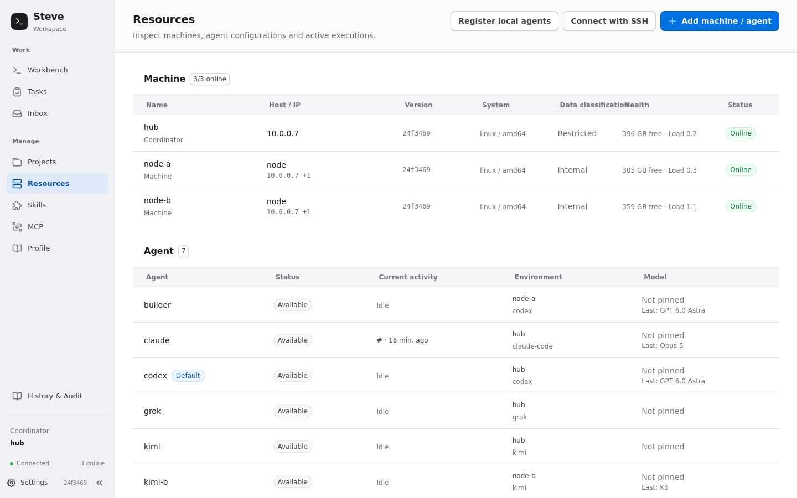
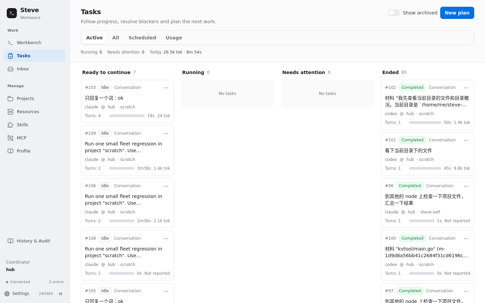
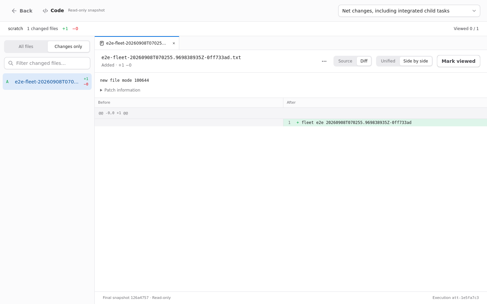
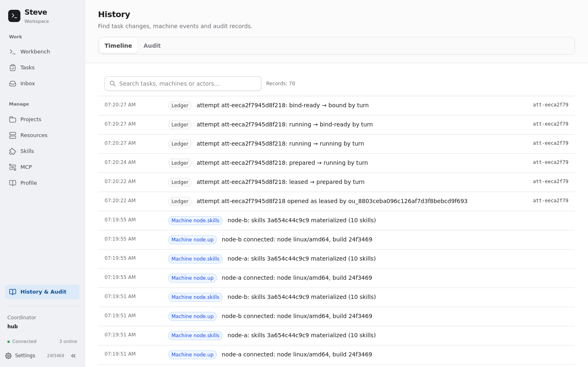
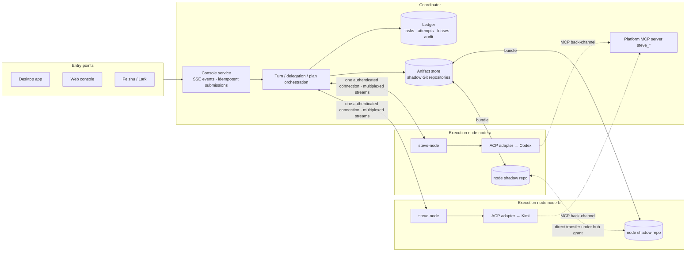

# Steve

[中文](README.md)

Steve is a personal platform for agent work across machines. It takes the coding agents you already use and are already signed in to — Codex, Claude Code, Kimi Code, Grok — and turns them into a team that works across your computers. Its desktop app and Web console (with Feishu/Lark as an optional channel) manage projects, conversations and tasks, place and delegate work according to machine capabilities, and record progress, artifacts, approvals and recovery state.

Steve makes three structural commitments:

- **The platform handles delivery**: it renders and records replies, persists delegation results and sends them back to the parent conversation with their actual landing status.
- **Execution has explicit boundaries**: admission uses machine observations, project access and data levels constrain placement, built-in MCP uses conversation-bound tokens, and policies handle tool permissions.
- **Work leaves a record**: tasks, attempts, artifacts and landing states enter the ledger. Recovery rules determine whether interrupted work continues or records a failure, with approvals and external-effect reconciliation available for inspection.

## What it does

- **One sentence, several machines.** Tell the coordinating agent "create kvtool: builder on node-a writes the code, shipper on node-b writes the tests, review once it has landed" — it looks the fleet up, splits the work, delegates in parallel, and builds and tests the delivered result locally.
- **Your own agents, your own logins.** No model API is re-implemented and no tool is replaced. Codex / Claude Code / Kimi / Grok on each machine speak [ACP](https://agentclientprotocol.com) (Agent Client Protocol) and run in an isolated home Steve prepares, referencing only your credentials.
- **Every turn leaves a reviewable change.** The working directory is snapshotted before and after each turn; a change card sits under the reply, opening into a file tree, source and diff. Changes made on another machine merge back into the canonical directory.
- **Interrupted work resumes.** A flaky network, a coordinator restart, or another computer taking over coordination leaves the running agent process on its machine, reattached by input receipts and output sequence numbers. What cannot be reattached says so — the prompt is never replayed.
- **Who is doing what, at what cost.** Resources shows live activity per machine and agent, the task board shows progress and blockers, usage shows tokens / TPM / duration, history shows ledger events and audit records.
- **Where you already are.** The macOS app, the browser console and Feishu/Lark DMs and groups share one set of projects, tasks and one ledger.

## Screens

Workbench: the coordinating agent delegates one job to shipper on node-b; the child finishes, the file lands in the canonical directory, and the net change sits under the reply.



Resources: three machines, seven agents — who is online, who is busy, which model they used last.



Task board and Review: tasks by running / needs attention / ended; Review opens the read-only snapshot taken when the execution ended.





History and audit: every attempt state transition, node connection and skill sync is in the ledger.



## Architecture and what it buys you



- **The coordinator** (still `hub` internally) schedules, keeps the ledger and artifact store, and serves the console. One machine is a coordinator on its own; in the desktop app's multi-machine mode every full node holds a ledger replica and votes, coordination can be handed over, and automatic failover counts physical failure domains.
- **An execution node** needs one `steve-node` binary and one port. It advertises its tools, harnesses, skills, MCP servers and health, and starts and owns the agent processes itself — they survive the coordinator disconnecting or changing.
- **An agent is configuration, not a process**: machine + harness + preferred model + requirements + skills + MCP. Directories belong to projects, not agents; a project can have its canonical directory on one machine and copies on others.
- **Everything passes through the ledger**: task-tree budgets, the attempt state machine (leased → prepared → running → … → bound), leases, approvals and external effects commit inside one transaction boundary. The UI is a projection.

## How communication and sharing work, and why

| Concern | How | Why this way |
|---|---|---|
| Attaching agents | Each tool's official ACP adapter runs as a stdio child process; Steve prepares an isolated home per harness (`runtimes/<harness>`) that only links credentials and copies a filtered model/provider config. | Reuse the tools and model quota you are already signed in to instead of re-doing API integration; the isolated home keeps the hooks, skill directories and MCP lists of your terminal out of an unattended server. |
| Coordinator ↔ node | The coordinator dials out; one token-authenticated TCP connection multiplexes streams (sessions, process streams, artifact operations, files, MCP probes, restarts); on connect the node's advert and feature list are exchanged (`process_journal.v1`, `artifact_ops.v1`, `node_config_revision.v1` …). | A node opens one port; old and new versions coexist by feature negotiation, and a missing capability says "node needs an upgrade" instead of degrading silently. |
| Reattaching after a drop | The node keeps the agent process and a bounded input/output journal; on reconnect the stream resumes by stream ID, read output position and acknowledged input, with a default grace of 10 minutes. | A network blip or a coordinator restart must not kill an agent mid-edit; resumption is based on receipts and sequence numbers, never on sending the prompt again. |
| Node-owned sessions | The node persists sessions, a receipt per input and the execution authority; a new coordinator instance verifies the original records before reattaching the same execution, and `inspect-open` / `cancel-open` cover a lost creation receipt. | Handing over coordination is not stopping the task; an absent record does not prove nothing was created — only a durable cancel tombstone proves it will not start. |
| Platform capabilities | Steve is itself an MCP server (`steve_delegate` / `steve_await` / `steve_remember` / `steve_projects` …) with per-session tokens; agents on a node reach it through the node's back-channel. | "How to collaborate" lives in server-side tools, so control stays with the platform rather than in prompt text; per-session tokens make delegation and memory writes attributable. |
| External MCP and secrets | MCP definitions and secrets stay on the execution node (or in a separate broker process); an agent only receives a bound loopback address or launcher command. | Secrets never enter prompts, pass through the coordinator, or reach logs. |
| Artifacts and sharing | One shadow bare Git repository per project; a snapshot before and after every turn (uncommitted files included, nested repositories skipped, size-limited); snapshots taken on a node travel to the coordinator as bundles and replica records enter the ledger; with `direct_transfer` nodes exchange bundles directly under the coordinator's grant. | Git is the most reliable content-addressed diff and packaging tool available, so no format is invented; the shadow repository never touches your repository or branches; replica records make "which machine has which version" answerable and let a returning node be filled in. |
| Landing | Isolated executions (delegations, plan steps) publish their result as an artifact first, then merge and land into the project's canonical directory; queued, conflicted and landed are distinct states. | "The child finished" and "the files reached the canonical directory" are two facts; a held canonical lock means queueing, not overwriting. |
| Who may write a directory | The canonical directory, copies and endpoint slots carry leases; every attempt transition is fenced by the leases it holds, and losing one cancels the turn. | Two agents cannot edit one directory at once; an execution that lost its lease cannot commit over a newer one. |
| Ledger | SQLite on a single machine; in the desktop multi-machine mode the ledger is replicated with Raft to full nodes, only a majority can write, and voters must be in different physical failure domains. | Handover and failover rest on a real majority; three processes on one machine do not make three nodes. |
| Where data may go | Projects and machines carry data levels (public / internal / restricted / sealed), compared at admission; sealed content never leaves its home machine. Leases are issued per region. | "May this code go to that machine" becomes a scheduling constraint instead of something a person remembers. |
| Console | A read model plus an SSE event stream; streamed progress is coalesced at 100 ms and a turn shows its preparing / processing / finishing / saving phases; submissions carry an idempotent `command_id` and drafts persist locally. | A retry after a dropped connection cannot create a second piece of work; nothing is reported done before it is durable; a token does not rewrite the whole conversation. |
| Duplex delegation | A child's result is persisted and delivered back into the parent conversation by the platform, which then continues the parent; no polling. | Ending the parent turn and waiting is cheaper and more reliable than looping on `steve_await`. |

## What it avoids

- Two agents editing the same directory → directory leases; the second one queues or picks another project.
- A coordinator restart killing running work → processes live on execution nodes and reattach through the journal; what cannot reattach is quarantined for verification rather than guessed from a TTL.
- "Send it again" after a drop running the work twice → input receipts, `command_id` idempotency, cancel tombstones.
- Carrying your terminal's hooks / skills / MCP lists into an unattended server → isolated homes that copy only model access configuration.
- Secrets in prompts or logs → broker bindings; agents see a loopback address only.
- Confusing "done" with "landed" → artifact, landing and delivery are three separately recorded states.
- Unreported tokens counted as zero usage → charts plot 0 but report coverage separately, and "reported zero" is distinct from "not reported".
- Fake failover → full nodes are counted by physical failure domain, and new nodes may not take over automatically by default.

## Start with the desktop app

On macOS, run `make desktop` to build the native app. The script prints the path to `Steve.app`. First launch initializes this computer as the coordinator; no other machine is required. Register existing local agents when ready, and connect other machines through SSH discovery in Resources.

Closing the window leaves the backend running. See the [desktop and multi-node guide (Chinese)](docs/desktop.md) for installation, storage authorization, handover, quorum requirements and recovery. Full replicas require Restricted data access or higher; shared-ledger deployments do not support sealed projects.

## Standalone Web console

The console can run independently without a Feishu/Lark application. Set `gateway.owner_id` for a standalone deployment. To add Feishu/Lark, configure both application credentials and its channel owner. Both entry points share projects, tasks and the ledger.

Prepare Go 1.27+, Git, Node.js with npm, and an authenticated coding agent. Steve downloads and verifies pinned versions of the built-in `codex-acp` and `claude-agent-acp` adapters. The first download requires npm registry access; subsequent starts use the local cache.

1. Build and copy the minimal configuration from the repository root:

   ```bash
   make build
   cp config.console.example.json config.json
   chmod 600 config.json
   ```

2. Edit `config.json`: set `projects.workspace.home.path` to an existing project directory and `gateway.owner_id` to a stable owner identifier for this deployment. The example uses codex with the `read` permission policy. Adjust `agents` / `harnesses` for other tools. A self-managed adapter can use an absolute `command` path instead of `adapter`; specify one, not both.

   [config.console.example.json](config.console.example.json) is the standalone example. [config.example.json](config.example.json) covers multiple machines, regions, MCP and optional Feishu/Lark; replace placeholders and remove unused sections before using it.

3. Check the configuration, then start the Hub:

   ```bash
   ./steve doctor -config config.json
   ./steve run -config config.json
   ```

   Doctor prepares runtime directories and starts configured tools for probing; it is not a read-only production health check. Feishu/Lark is validated and connected only when configured. A standalone console prepares identity and memory files locally.

4. Leave run active and open the console from another terminal:

   ```bash
   ./steve dash
   ```

   The default address is `http://127.0.0.1:7710`. Send `/project use workspace`, then `@codex List this project's files and explain their purpose`. In the composer, Enter inserts a newline and **Shift+Enter sends**. When a tool asks for permissions beyond the `read` policy, approve or decline the request within the current turn; see the [permission reference](docs/operations.md#harnessesname).

For Feishu/Lark, `./steve setup` accepts an existing application and `./steve setup -create-app` uses the official device flow. Confirm your application-scoped `open_id`. Once configured, Feishu/Lark and the console can be used together. See [console access and credentials](docs/operations.md#控制台与凭据) for remote access, custom addresses and tokens.

The console includes the workbench, tasks, projects, resources, skills, MCP, profile, inbox, history/audit and Settings at the bottom of the sidebar. Tasks opens the board. General settings offers Simplified Chinese, English or the browser language. Switching languages preserves drafts, file tabs and reading position, and does not rewrite user input, agent replies or historical text.

The workbench supports `/` and `@` completion, queued messages, tool permission requests and agent questions. Answers go directly to the waiting turn instead of entering the task queue; retries retain the same answer identity. Materials can come from conversations, snapshot text or file uploads, with text selections, source/Diff line ranges, image rectangles and project-scoped annotations. Submitted references are frozen rather than rereading changing files. See [materials, annotations and questions](docs/operations.md#材料标记与问答).

Usage provides **1d / 7d / 30d** trends: hourly buckets for the Hub's current day, or the last 7 / 30 calendar days including today. Unreported token points plot as **zero** with a continuous line; reporting coverage remains visible separately. Input/output tokens, cache reads/writes, TPM, task latency and breakdowns by agent, model, harness, trigger and project share the selected interval, with expandable task details.

Each reply can show an expandable change card with file and line totals, the first three files, and direct Review links to that execution's snapshot. Selecting reply text, source or Diff opens actions to add a reference, inspect details or ask in an independent side chat while keeping the original conversation and draft. The conversation's Code view combines the file tree, highlighted source, line numbers, file tabs and source/Diff views. It reads the selected execution's start or end snapshot and is read-only. Settings groups General, Channels, Execution & resources, and Nodes & services. Channels configures the default channel, Feishu/Lark credentials and access rules. Saved service settings are distinguished from running values. Nodes & services can restart an idle Hub or node after confirmation and verify the new process after reconnection; version and ownership details are secondary. No upgrade action is provided.

## Core concepts

| Concept | Meaning |
|---|---|
| hub | The Steve process responsible for coordination, the ledger and the console. Its machine also advertises capabilities and executes work as a node. |
| node | An execution machine running `steve-node`, which starts local harness processes and reports tools, capabilities and health to the hub. |
| agent | A named execution configuration: machine, harness (ACP tool), preferred model, requirements, session options, skills and MCP. The tool's session report determines the actual model. |
| project | A workspace and its rules: one canonical `home`, optional workspaces on other machines, a data level and an execution mode. Directories belong to projects, not agents. |
| channel | A conversation delivery channel such as `console` or `feishu`. Agents use `channel_send`, `channel_update` and `channel_recall` for progress messages; the adapter renders and delivers them. |
| conversation and exchange | A conversation contains dialogue bound to a project. An exchange is one console input and its queue state, execution, progress and reply; a conversation contains multiple exchanges. |
| task and child task | A task holds a goal, budget and execution history across exchanges. Delegation creates children under the parent task, sharing its remaining budget and subject to depth and cycle limits. |
| attempt | A ledger record of one execution, including the agent, machine, workspace, leases and result. Recovery creates new execution records. |
| artifact and landing | Workspace snapshots become traceable artifacts. Isolated results merge and land in the canonical directory, with separate queued and conflict states. Shadow snapshots include uncommitted files, subject to snapshot ignore and size rules. |
| memory | Global memory holds user preferences; project memory holds conventions for the bound project. Both are injected on the first turn of new owner DM and owner console sessions. `steve_remember` / `steve_recall` / `steve_forget` provide access, with locks and audit records for writes; groups, guests and delegated children cannot write. Remember retains idempotency keys within the same scope for 24 hours. |

`gateway.task_max_turns` and `gateway.task_max_elapsed` both default to **0 (unlimited)**. `gateway.prompt_timeout` defaults to **10 minutes** of silence without text, tool calls or reports; it is not a limit on total turn duration.

## Work across machines

Add a machine from the console's resources page using its name, data level and an `ip:port` reachable by the hub. Run the generated bootstrap command on that machine, then add an agent bound to it. Registration persists the configuration and takes effect immediately, without restarting the hub.

The target needs Git, authenticated harnesses and a `steve-node` binary matching its OS and CPU architecture. The hub can serve a binary built with `CGO_ENABLED=0` through `gateway.node_binary`, or you can copy it with `scp`; see [node deployment](docs/operations.md#部署-node). The hub URL in the bootstrap command must be reachable from the node. Bootstrap copies only harness `command` / `args`, not authentication, environment or other harness settings, and it does not update an existing executable. Start nodes and locally provided wrappers such as `nodectl` from a login shell.

After negotiating **`process_journal.v1`**, a dropped connection leaves the node process alive. The hub reattaches using acknowledged input and output sequence numbers, with a default **10-minute** grace period. Legacy nodes, expired grace, unavailable replay logs or a lost node process still cause failure. A Hub restart first quarantines executions without proof that they stopped, then recovers settled attempts and eligible tasks. This is separate from reattaching the original process stream.

On a remote node the platform's share of a turn is almost entirely round trips: admission and the two snapshots around the turn are one trip each. The hub logs one `turn: timing` line per turn with every phase's duration.

## Duplex delegation

An agent uses `steve_delegate` to hand off bounded work. After a short inline wait, the call returns the child's ID and state while the child runs independently. Results are persisted; when the parent turn ends or the parent task is idle, Steve delivers them as a new message to the parent conversation and continues the work. Paused or finished parents retain the results for inspection.

The parent agent can end its turn and wait for platform delivery; **polling is no longer required**. `steve_await` remains available for actively retrieving results. Delivery reports whether changes landed, remain queued or conflicted: completing a child task and landing its files are separate states.

## Checks and gates

| Command | Scope |
|---|---|
| `make test` | Local Go tests, race checks and dependency boundaries. |
| `make test-console` | Frontend boundaries, build and isolated browser interactions. |
| `make e2e-fleet` | Checks a named remote delegation, attempt, changes, usage and landing on an existing fleet; default and maximum client deadline **10 minutes**. |
| `make e2e-autonomous` | Checks fleet discovery, parallel decomposition and delegation, capability placement and proactive result delivery; default and maximum **20 minutes**, requiring `kvtool/main.go` in the project's canonical directory and a remote node advertising `build`. |

[CI](.github/workflows/test.yml) runs gofmt, vet, race tests, frontend builds, dependency checks and isolated browser tests, without live fleet gates. The live gates use existing hub and node processes and do not build, deploy or restart them; they create real tasks and files. Connection options, required tools, timeout handling and PR evidence requirements are in [CONTRIBUTING.md](CONTRIBUTING.md) and [operations](docs/operations.md#门禁与-ci).

## Further reading

- [docs/architecture.md](docs/architecture.md): module dependencies, authority, commit and query boundaries.
- [docs/operations.md](docs/operations.md): configuration keys, deployment, gates and troubleshooting.
- [docs/history/](docs/history/): archived console and capability proposals and the collaboration audit.
- Code: entry points in [cmd/](cmd/), core implementation in [internal/](internal/), console in [web/console/](web/console/), acceptance checks in [e2e/](e2e/).

## License

Apache-2.0
