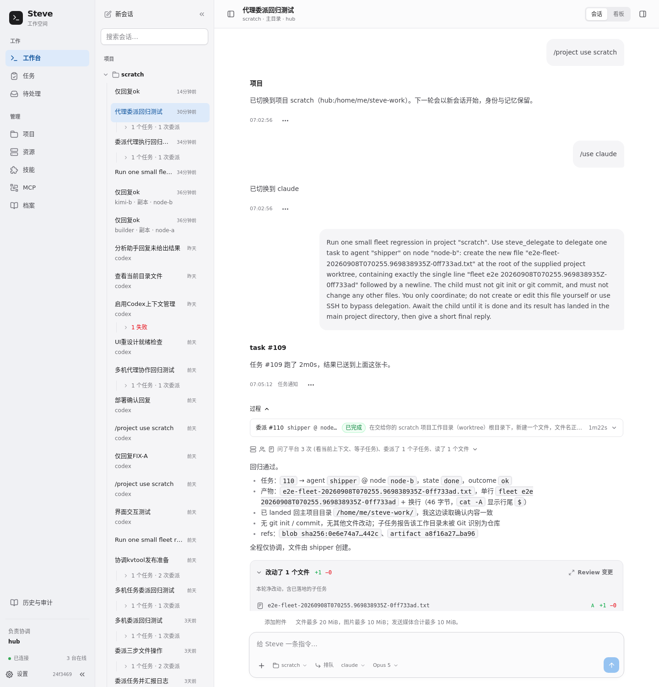
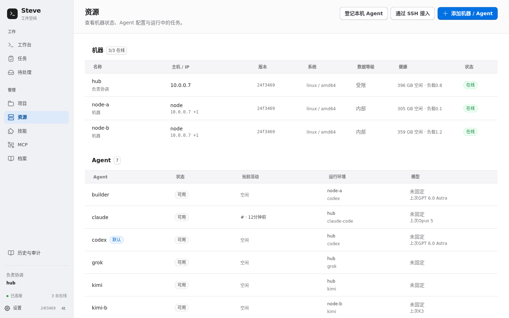
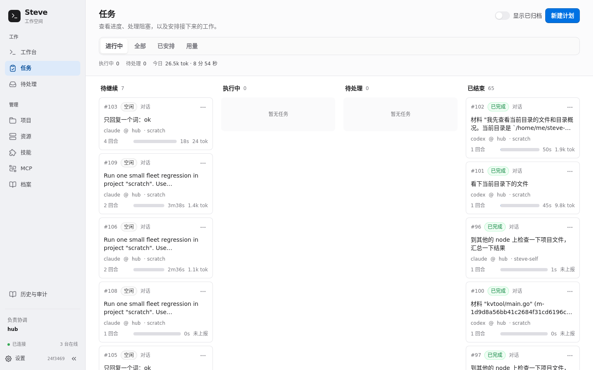
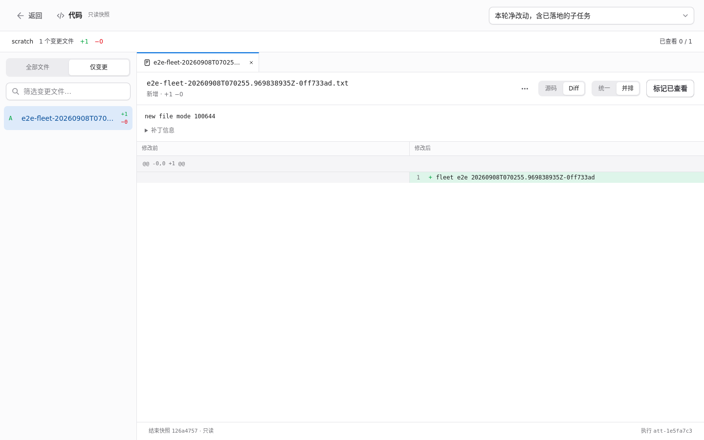
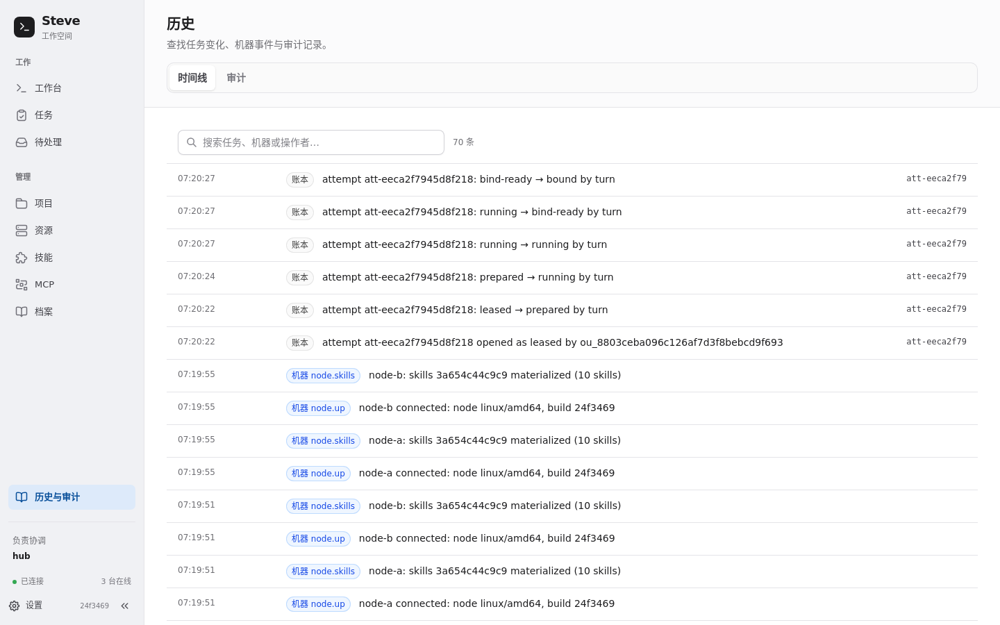
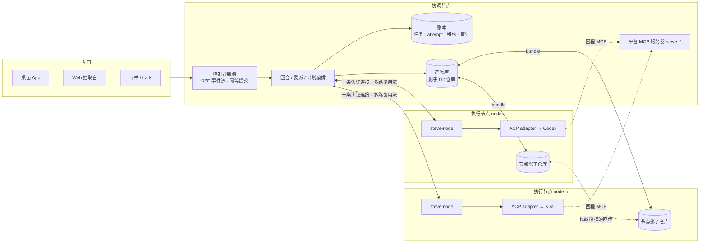

# Steve

[English](README.en.md)

Steve 是面向个人的多机 agent 工作平台：把你已经在用、已经登录好的 coding agent（Codex、Claude Code、Kimi Code、Grok……）接成一支能跨机器协作的队伍。通过桌面 App 或 Web 控制台（飞书是可选通道）管理项目、会话与任务，按机器能力执行和委派工作，记录过程、产物、审批与恢复状态。

Steve 提供三条结构性承诺：

- **平台负责交付**：回复由平台渲染和记录；委派结果持久化后主动送回父会话，附上实际落地状态。
- **执行有明确边界**：机器按实际申报准入，项目权限与数据等级约束执行位置；内置 MCP 使用会话绑定的 token，工具权限由策略处理。
- **工作有账可查**：任务、attempt、产物与落地状态进入账本；中断后按恢复规则续跑或明确记录失败，保留审批与对外动作的对账入口。

## 它能做什么

- **一句话，多台机器一起干**：对协调 agent 说"新建 kvtool，builder 在 node-a 写代码、shipper 在 node-b 写测试，落地后复核"，它查机群、拆解、并行委派，结果送回来后在本机 build/test 复核。
- **用你自己的 agent 和登录态**：不重新实现模型调用，也不要求换工具。每台机器上的 Codex / Claude Code / Kimi / Grok 以 [ACP](https://agentclientprotocol.com)（Agent Client Protocol）接入，运行在 Steve 准备的隔离 home 里，只引用你的凭据。
- **每一轮都有可审阅的变更**：回合前后拍工作目录快照，回复下方直接是变更卡片，点开就是文件树、源码和 Diff；委派到别的机器的改动经合并落回主目录。
- **断了能接上**：网络抖动、协调节点重启、换一台电脑当协调节点，正在跑的 agent 进程留在执行机器上，按输入回执和输出序号续接；接不上的明确说"没接上"，不重放 prompt。
- **知道谁在做什么、花了多少**：资源页看机器与 agent 的实时活动，任务看板看进度和阻塞，用量页看 token / TPM / 耗时，历史页看账本事件与审计。
- **在你习惯的地方用**：macOS 桌面 App、浏览器控制台、飞书/Lark 私聊与群聊共享同一套项目、任务和账本。

## 界面

工作台：协调 agent 把一件事委派到 node-b 上的 shipper，子任务完成、文件落回主目录，回复下方是本轮净变更。



资源页：三台机器、七个 agent，谁在线、谁在忙、上次用的模型。



任务看板与 Review：任务按进行中 / 待处理 / 已结束分栏；Review 打开的是执行结束时的只读快照。





历史与审计：attempt 的每一次状态转换、机器上下线、技能同步都在账本里。



## 架构与优势



- **协调节点**（内部仍叫 hub）负责调度、账本、产物库和控制台。单机就是一台协调节点；桌面 App 多机模式下，完整节点各持一份账本副本、参与投票，协调职责可以交接，自动容灾按物理故障域计票。
- **执行节点**只需要一个 `steve-node` 二进制和一个端口。它申报本机的工具、harness、技能、MCP 与健康状态，自己启动并持有 agent 进程，协调节点断开或更换时进程不死。
- **agent 是配置，不是进程**：机器 + harness + 偏好模型 + 能力要求 + 技能 + MCP。目录属于项目，不属于 agent；同一个项目在不同机器上可以有主目录和副本。
- **一切经过账本**：任务树预算、attempt 状态机（leased → prepared → running → … → bound）、租约、审批与对外动作都在同一个事务边界里提交，界面只是投影。

## 通信与共享是怎么做的，为什么

| 事情 | 做法 | 为什么这么做 |
|---|---|---|
| 接入 agent | 每种工具的官方 ACP adapter 以 stdio 子进程方式启动；Steve 为每个 harness 准备隔离 home（`runtimes/<harness>`），只链接凭据、复制筛选后的模型/provider 配置。 | 复用你已经登录的工具与模型额度，不重做一遍 API 接入；隔离 home 不把你终端里的 hooks、技能目录、MCP 清单带进服务器。 |
| 协调节点 ↔ 执行节点 | 协调节点主动拨号，一条 token 认证的 TCP 连接上多路复用多条流（会话、进程流、产物操作、文件、MCP 探测、重启）；连接时交换 advert 与 feature 列表（`process_journal.v1`、`artifact_ops.v1`、`node_config_revision.v1` …）。 | 节点只开一个端口；新旧版本靠 feature 协商共存，缺能力时报"节点需要升级"而不是静默降级。 |
| 断线续接 | 节点持有 agent 进程和有界的输入/输出 journal；重连后按流 ID、已读输出位置和已确认输入续接，默认宽限 10 分钟。 | 网络抖动或协调节点重启不该杀掉正在写代码的 agent；续接依据是回执和序号，不是"再发一次 prompt"。 |
| 节点自持会话 | 节点保存会话、每条输入的回执和执行授权；换协调节点后新实例核对原记录再接回同一次执行，`inspect-open` / `cancel-open` 处理创建回执丢失的情况。 | 交接只改变协调职责，不等于原任务停止；查不到记录不等于没创建过，只有持久的取消墓碑才证明不会再启动。 |
| 平台能力 | Steve 自己是一个 MCP 服务器（`steve_delegate` / `steve_await` / `steve_remember` / `steve_projects` …），token 按会话签发；节点上的 agent 通过节点回程通道调回协调节点。 | "怎么协作"是服务器上的工具，控制权在平台而不是在提示词里；每个会话的 token 让委派、记忆写入都能记名。 |
| 外部 MCP 与密钥 | MCP 定义和密钥留在执行节点（或独立 broker 进程）；agent 只拿到绑定后的 loopback 地址或启动器命令。 | 密钥不进 prompt、不过协调节点、不进日志。 |
| 产物与共享 | 每个项目一个影子 Git 裸仓库，回合前后各拍一次快照（收录未提交文件，跳过嵌套仓库，有大小上限）；节点上的快照以 bundle 搬运到协调节点，副本记录写账本；开启 `direct_transfer` 后节点之间在协调节点授权下直传。 | Git 是最可靠的内容寻址、diff 与打包工具，不用自造格式；影子仓库不碰你的仓库和分支；副本记录让"哪台机器有哪个版本"可查，节点恢复后能补齐。 |
| 落地 | 隔离执行（委派、计划步骤）的结果先发布为产物，再经合并落回项目主目录；排队、冲突、已落地是分开的状态。 | "子任务完成"和"文件到了主目录"是两件事；主目录锁被占用时排队而不是覆盖。 |
| 谁能写目录 | 主目录、副本、endpoint 并发槽都有租约；attempt 的每次状态转换都以持有的租约为栅栏，租约丢失就取消回合。 | 两个 agent 不能同时改一个目录；一个失去租约的旧执行不能把结果提交到新执行之上。 |
| 账本 | 单机是 SQLite；桌面多机模式下账本以 Raft 复制到完整节点，只有多数派能写，投票成员必须在不同物理故障域。 | 交接与容灾建立在真实多数派上；同一台机器起三个进程凑不出三节点。 |
| 数据去哪 | 项目有数据等级（public / internal / restricted / sealed），机器也有；准入时比较，sealed 内容不离开主机。租约按区域签发。 | 让"这段代码能不能到那台机器"成为调度约束，而不是靠人记住。 |
| 控制台 | 只读模型 + SSE 事件流；流式进度 100 ms 合并，回合分准备 / 处理 / 整理 / 保存四个阶段显示；提交带 `command_id` 幂等键，草稿本地持久化。 | 断网重试不会发出第二份工作；未落盘不提前报成功；每个 token 不重写整份会话。 |
| 委派双工 | 子任务结果持久化后由平台送回父会话并续跑，父 agent 不需要轮询。 | 父 agent 结束回合去等，比循环 `steve_await` 便宜也可靠。 |

## 规避了什么问题

- 两个 agent 同时改同一个目录 → 目录租约，第二个拿不到锁就排队或换项目。
- 协调节点重启把正在跑的任务杀掉 → 进程在执行节点上，journal 续接；接不上就隔离并要求核实，不靠 TTL 猜。
- 断线后"再发一次"造成重复执行 → 输入回执、`command_id` 幂等、取消墓碑。
- 把终端里的 hooks / 技能 / MCP 清单带进无人值守的服务器 → 隔离 home，只复制模型访问配置。
- 密钥写进 prompt 或日志 → broker 绑定，agent 只见 loopback 地址。
- 分不清"做完了"和"落地了" → 产物、落地、投递三个状态分开记。
- 未上报 token 被当成零消耗 → 图里按 0 画，但覆盖率单独展示，"已上报零"和"未上报"分开记。
- 假容灾 → 完整节点按物理故障域计票；新节点默认不允许自动接任。

## 从桌面 App 开始

macOS 上运行 `make desktop` 构建原生 App，构建脚本会输出 `Steve.app` 的位置。首次启动本机即为协调节点，无需其他机器；可以先打开工作台，再选择登记已有 Agent。资源页支持从本机 SSH config 选择并接入机器。

关闭窗口保留后台任务。协调职责可以交接，原执行按实际状态续接或进入恢复问答。安装、数据授权、节点规模与故障处理见 [桌面 App 与多机协作](docs/desktop.md)。

## 独立 Web 控制台

控制台可以独立运行，无需飞书应用。独立部署配置 `gateway.owner_id`；需要飞书/Lark 时，再配置成对的应用凭据及该通道的 owner。两种启动方式共享项目、任务和账本。

准备 Go 1.27+、Git、Node.js 与 npm，以及一个已完成认证的 coding agent。内置适配器 `codex-acp`、`claude-agent-acp` 由 Steve 按固定版本下载和校验；首次取用需要 npm registry，之后使用本机缓存。

1. 在仓库根目录构建并复制最小配置：

   ```bash
   make build
   cp config.console.example.json config.json
   chmod 600 config.json
   ```

2. 编辑 `config.json`：把 `projects.workspace.home.path` 改成已有项目目录，`gateway.owner_id` 改成部署使用的稳定 owner 标识。默认只使用 codex，权限策略为 `read`。需要其他工具时调整 `agents` / `harnesses`；自备适配器可使用绝对路径 `command`，与 `adapter` 二选一。

   [config.console.example.json](config.console.example.json) 是不带飞书的最小配置；[config.example.json](config.example.json) 展示多机、区域、MCP 和可选飞书配置，使用前需要替换占位值并删除不用的部分。

3. 体检后启动 Hub：

   ```bash
   ./steve doctor -config config.json
   ./steve run -config config.json
   ```

   doctor 会准备运行目录并启动已配置工具进行探测，不是线上只读健康检查。只有配置了飞书凭据时才验证并连接飞书；独立控制台会在本地准备身份和记忆文件。

4. 保持 run 运行，在另一终端打开控制台：

   ```bash
   ./steve dash
   ```

   默认地址是 `http://127.0.0.1:7710`。在工作台发送 `/project use workspace`，再发送 `@codex 列出这个项目的文件并说明用途`。输入框里 Enter 换行、**Shift+Enter 发送**。工具需要超出 `read` 策略的权限时，可以在本轮权限请求中明确批准或拒绝，详见 [权限说明](docs/operations.md#harnessesname)。

需要飞书/Lark 时，可用 `./steve setup` 录入已有应用，或用 `./steve setup -create-app` 走官方设备流；确认应用下自己的 `open_id`。配置完成后，飞书与控制台可同时使用。远程访问、地址与 token 参数见 [控制台与凭据](docs/operations.md#控制台与凭据)。

控制台包括工作台、任务、项目、资源、技能、MCP、档案、待处理、历史与审计，以及侧栏底部的设置入口。任务入口打开看板。设置的通用页支持简体中文、English 或跟随浏览器；切换语言保留草稿、文件标签和阅读状态，不改写用户输入、Agent 回复或历史正文。

工作台支持 `/`、`@` 补全、排队、工具权限请求与 Agent 提问。问题的答复直接送回等待中的本轮，不作为新任务排队；断网后重试使用同一答复标识。材料可来自会话、快照文本或上传文件，支持文本选段、源码/Diff 行范围、图片矩形选区和按项目保存的标记；发送时引用的材料被固定，不会随后读取变化中的文件。见 [材料、标记与问答](docs/operations.md#材料标记与问答)。

用量页提供 **1d / 7d / 30d** 趋势：1d 按 Hub 当天小时统计，7d / 30d 为含今天的最近日历天。未上报 token 的图表点按 **0** 绘制并保持连线，上报覆盖率仍单独展示。输入、输出、缓存读取/写入、TPM、任务耗时，以及 Agent / 模型 / harness / 触发方式 / 项目明细使用同一范围，任务明细可继续展开。

每轮回复下方直接展示变更卡片，汇总文件数与增删行，默认显示前三个文件并可展开；点击文件或 Review 进入该轮快照。选中回复、源码或 Diff 后可就近加入对话、查看详情或在独立侧聊中提问，侧聊保留主对话及其草稿。会话详情的「代码」入口统一浏览文件和变更，提供文件树、源码高亮与行号、文件标签、源码 / Diff 切换。内容来自所选执行的开始或结束快照，工作区只读。设置中心分为通用、Channel、执行与资源、节点与服务。Channel 可设置默认通道、飞书/Lark 凭据及访问规则；服务配置区分已保存值与运行值。节点与服务页可确认后重启空闲 Hub 或节点，重连后核对新进程与生效配置；版本和归属为次要详情，不提供升级操作。

## 核心概念

| 概念 | 含义 |
|---|---|
| 协调节点 | 当前负责调度与协作记录的机器。职责可在完整节点间交接；内部配置和部分 CLI 仍使用 `hub` 标识。 |
| node | 执行机器，提供本机工具、能力和健康状态。完整节点还持有协作账本并参与投票；单独运行 `steve-node` 的执行节点不参与投票。 |
| agent | 命名的执行配置：机器、harness（ACP 工具）、偏好模型，以及能力要求、会话选项、技能和 MCP。实际模型以工具的会话报告为准。 |
| project | 一件工作的目录与规矩：唯一主目录 `home`、可选的其他机器工作区、数据等级和工作方式。目录属于项目，不属于 agent。 |
| channel | 会话的消息通道，如 `console`、`feishu`。Agent 通过 `channel_send / channel_update / channel_recall` 发送、更新、撤回本回合的进度消息；适配器负责呈现与投递。 |
| 会话与交换 | 会话是绑定项目的对话容器；交换（exchange）是控制台里一次输入及其排队、执行、过程和回复。一个会话可以包含多个交换。 |
| 任务与子任务 | 任务承载目标、预算和执行历史，可以跨多个交换；委派产生挂在父任务下的子任务，共用父任务的剩余预算，并受深度和环检测限制。 |
| attempt | 一次具体执行的账本记录，包含执行者、机器、工作区、租约和结果；接回原执行保留同一记录，另建恢复执行才产生新记录。 |
| 产物与落地 | 工作目录快照形成可追踪的产物；隔离执行的结果经合并与落地写回主目录，排队和冲突有独立状态。影子快照会收录未提交文件，受快照的忽略和大小规则约束。 |
| 记忆 | 全局记忆记录用户偏好，项目记忆记录当前项目的约定；在 owner 私聊和 owner 控制台的新会话首轮注入。`steve_remember` / `steve_recall` / `steve_forget` 提供读写，写入有锁和审计，群聊、访客及委派子任务不能写；remember 的同作用域幂等键保留 24 小时。 |

`gateway.task_max_turns` 和 `gateway.task_max_elapsed` 默认均为 **0（不限）**。`gateway.prompt_timeout` 默认 **10 分钟**，是没有文本、工具调用或报告的静默超时，不是整轮执行上限。

## 多机执行

在控制台"资源"页添加机器，填写 hub 能拨到的 `ip:port`、机器名和数据等级，再到目标机器执行生成的引导命令；随后添加绑定该机器的 agent。登记会写回配置并立即生效，无需重启 hub。

目标机器需要 Git、已认证的 harness 和适配目标 OS/CPU 架构的 `steve-node`。hub 可通过 `gateway.node_binary` 提供用 `CGO_ENABLED=0` 构建的二进制，也可手工 `scp`；完整步骤见 [node 部署](docs/operations.md#部署-node)。引导命令中的 hub 地址必须从 node 可达。引导只复制 hub harness 的 `command` / `args`，不复制认证、环境或其他 harness 配置，也不更新已存在的可执行二进制。node 和 `nodectl` 等自备启动脚本都应从登录 shell 启动。

协商了 **`process_journal.v1`** 的连接中断后，node 保留进程，hub 根据进程流的输入确认和输出序号续接；默认宽限 **10 分钟**。旧节点、超过宽限、日志不可回放或 node 进程已丢失时仍会失败。Hub 重启先隔离缺少停止证据的执行，再回收已确认静止的 attempt 并恢复符合条件的任务；这不等同于续接原进程流。

远端回合的平台开销几乎全是往返：每回合的准入、回合前后两次快照各是一次到节点的往返，hub 日志里每回合一行 `turn: timing` 给出各阶段耗时。

## 委派双工

agent 用 `steve_delegate` 交出一件有界工作；调用短暂等待后返回子任务 ID 和状态，子任务独立执行。完成结果会持久化，父回合结束或父任务空闲时，Steve 将结果作为新消息送回父会话并续跑；父任务已暂停或结束时保留结果供查看。

父 agent 可以结束当前回合等待平台投递，**不再需要轮询**。`steve_await` 仍可用于主动取结果；投递会说明改动已落地、仍在排队或发生冲突，子任务完成和文件落地是两个状态。

## 验证与门禁

| 命令 | 范围 |
|---|---|
| `make test` | 本地 Go 测试、竞态检查与依赖门禁。 |
| `make test-console` | 前端依赖门禁、构建和隔离浏览器交互测试。 |
| `make e2e-fleet` | 对已运行机群验证指定远端委派、attempt、改动、用量和落地；客户端默认及上限 **10 分钟**。 |
| `make e2e-autonomous` | 验证自主查机群、拆解并行委派、按能力执行和主动回传；默认及上限 **20 分钟**，需要项目主目录中的 `kvtool/main.go` 和申报 `build` 的远端节点。 |

[CI](.github/workflows/test.yml) 运行 gofmt、vet、race，以及前端构建、依赖门禁和隔离浏览器测试；不运行真实机群门禁。真实机群门禁使用已有 hub 和 node，不构建、部署或重启它们；会产生真实任务与文件。连接参数、前置工具、超时处理和 PR 证据要求见 [CONTRIBUTING.md](CONTRIBUTING.md) 与 [运维文档](docs/operations.md#门禁与-ci)。

## 继续阅读

- [docs/desktop.md](docs/desktop.md)：桌面安装、SSH 接入、协调交接与恢复。
- [docs/architecture.md](docs/architecture.md)：模块依赖、状态权威、提交与读取边界。
- [docs/operations.md](docs/operations.md)：逐键配置参考、部署、门禁与排障。
- [docs/history/](docs/history/)：旧控制台方案、能力清单方案与协作审计，作为历史记录保存。
- 代码入口：[cmd/](cmd/)、核心实现 [internal/](internal/)、控制台 [web/console/](web/console/)、验收 [e2e/](e2e/)。

## License

Apache-2.0
